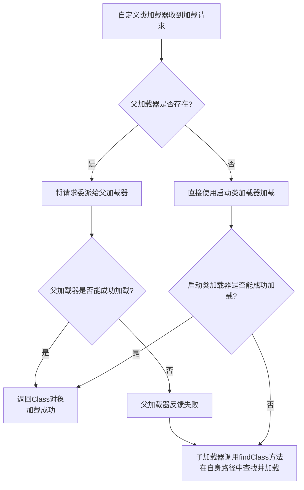

JVM 的类加载机制不仅仅是指“把类加载进内存”，它是一个完整的体系，主要由以下三个核心机制组成：

1.  **双亲委派模型**
2.  **全盘负责委托机制**
3.  **缓存机制**

其中，**双亲委派模型** 是最重要、最著名的机制。

---

### 1. 双亲委派模型

这是 JVM 类加载的**基本原则**和**工作流程**，它规定了类加载器应该如何协作去加载一个类。

#### 什么是双亲委派？
当一个类加载器收到类加载请求时，它**首先不会自己去尝试加载**这个类，而是把这个请求**委托给父类加载器**去完成。每一层的类加载器都是如此，因此所有的加载请求最终都应该传送到最顶层的启动类加载器（Bootstrap ClassLoader）中。

只有当**父类加载器反馈自己无法完成这个加载请求**（它的搜索范围中没有找到所需的类）时，子加载器才会尝试自己去加载。

#### 工作流程

1.  **向上委托**：`自定义类加载器` -> `应用类加载器(AppClassLoader)` -> `扩展类加载器(ExtClassLoader)` -> `启动类加载器(Bootstrap ClassLoader)`。
2.  **向下查找**：从顶层的启动类加载器开始**尝试加载**，如果加载成功，则直接返回 `Class` 对象。
3.  **失败反馈**：如果父加载器无法加载（在自己的路径下找不到该类），则**向下反馈**给子加载器。
4.  **自行加载**：子加载器在收到父加载器反馈的失败信息后，才会在自己的搜索路径中尝试加载。

#### 双亲委派的好处（为什么要有这个机制？）
*   **安全性**：防止核心Java API被随意篡改。比如，如果有人自定义了一个 `java.lang.Object` 类，如果没有双亲委派，这个类就会被加载，从而破坏Java的核心基础。但有了双亲委派，这个请求会一路委派到顶层的启动类加载器，而启动类加载器在 `rt.jar` 中找到了标准的 `java.lang.Object` 并加载它，自定义的 `Object` 类就不会被加载。
*   **避免重复加载**：确保一个类在JVM中**全局唯一**。当一个类被父加载器加载过后，子加载器就没有必要也没有机会再加载一次了，这保证了类的唯一性。

---

### 2. 全盘负责委托机制

这是对“双亲委派模型”的一个补充规则。

*   **“全盘负责”**：当一个类加载器加载一个类时，**除非显式地使用另一个类加载器**，否则该类所依赖和引用的其他类**也由这个类加载器负责加载**。
*   **“委托”**：这里的“委托”指的就是上面提到的**双亲委派**。

**举个例子**：
`ClassLoaderA` 成功加载了 `MyClass`，那么在 `MyClass` 中如果引用了 `java.util.HashMap`，那么 JVM 会自动由 `ClassLoaderA` 去尝试加载 `HashMap`。而 `ClassLoaderA` 会遵循“双亲委派模型”，将这个加载 `HashMap` 的请求先委托给它的父加载器，最终由启动类加载器完成加载。

这个机制确保了类及其所有依赖都是由**同一个类加载器体系**加载的，保持了依赖关系的一致性。

---

### 3. 缓存机制

JVM 的类加载器会**缓存已经加载过的类**。

*   **工作原理**：当一个类被加载后，该类会被存放在类加载器内部的一个缓存中。
*   **下次使用**：当程序再次需要加载这个类时，类加载器会首先从自己的缓存中查找是否已经加载过这个类。如果找到了，就直接返回缓存的 `Class` 对象；如果缓存中没有，才会按照“双亲委派模型”去加载它。

这个机制是保证性能的关键。想象一下，如果每次调用 `new Object()` 都需要重新从磁盘读取 `rt.jar` 并解析 `Object` 类，那程序的性能将是灾难性的。缓存机制避免了重复加载和解析的开销。

---

### 总结与关系

| 机制             | 核心思想                       | 解决的问题                                                   |
| :--------------- | :----------------------------- | :----------------------------------------------------------- |
| **双亲委派模型** | **向上委托，父辈优先**         | **安全性与类唯一性**（防止核心API被篡改，避免类被重复加载）  |
| **全盘负责委托** | **我加载你，我也负责你的依赖** | **依赖一致性**（保证一个类及其所有依赖由同一套类加载器体系加载） |
| **缓存机制**     | **一次加载，多次使用**         | **性能**（避免重复加载和解析类的开销）                       |

这三者协同工作，共同构成了 JVM 高效、安全、稳定的类加载机制：
*   加载请求到来时，首先检查**缓存**。
*   缓存未命中，则遵循**双亲委派**流程去加载。
*   成功加载一个类后，遵循**全盘负责**原则去加载其所有引用的类，并且每个类的加载过程又会回到第一步（检查缓存 -> 双亲委派）。