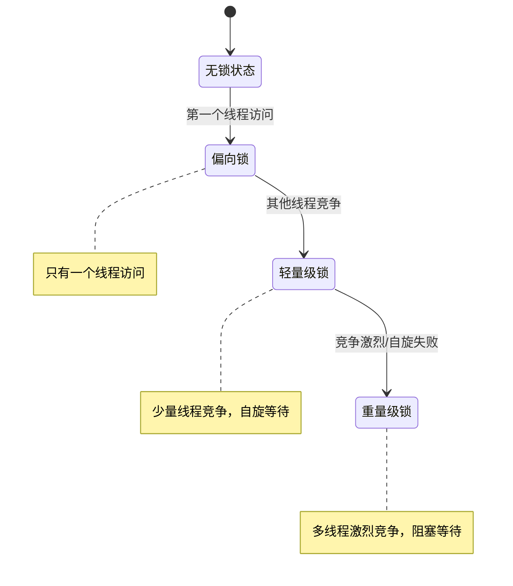
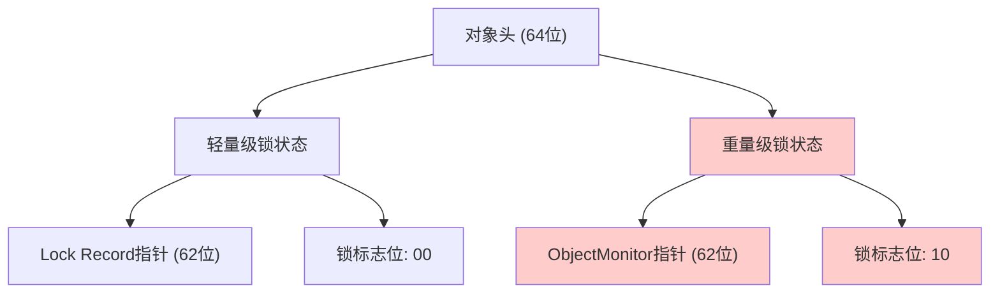
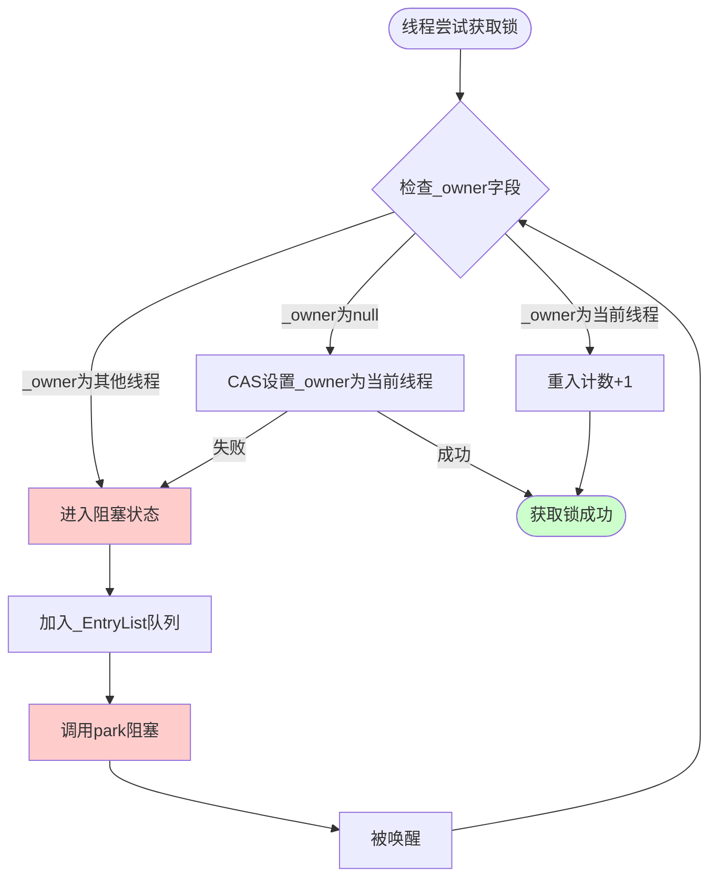
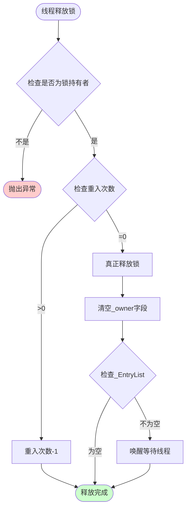
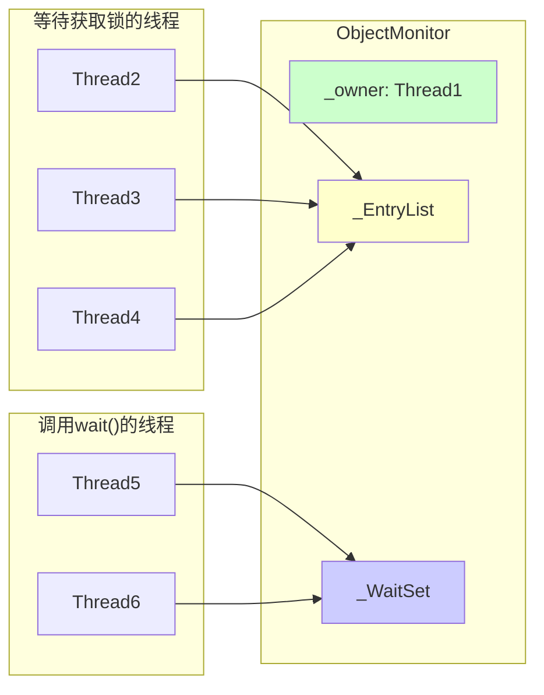
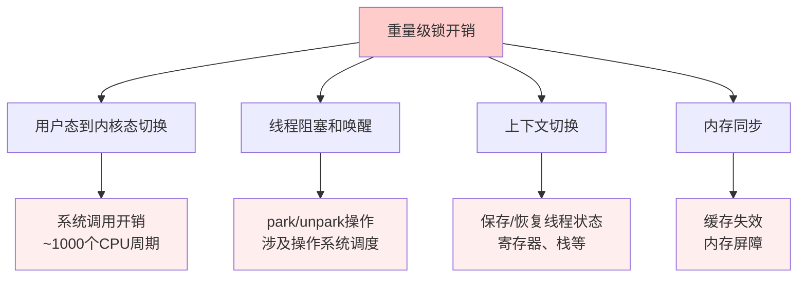
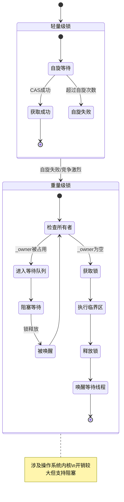

# Java 重量级锁原理详解

## 概述

重量级锁（Heavyweight Lock）是Java中synchronized关键字在高竞争情况下的实现方式。当轻量级锁竞争激烈时，JVM会将锁升级为重量级锁。重量级锁依赖于操作系统的互斥量（Mutex）实现，涉及用户态和内核态的切换，因此开销较大。

## 锁升级过程

Java的synchronized锁有四种状态，会根据竞争情况逐步升级：



## 重量级锁的核心组件

### 1. ObjectMonitor结构

重量级锁的核心是ObjectMonitor对象，其主要字段包括：

```java
// ObjectMonitor的关键字段（C++实现）
class ObjectMonitor {
    volatile markOop _header;     // 对象头备份
    void* volatile _object;       // 关联的对象
    void* volatile _owner;        // 持有锁的线程
    volatile jlong _previous_owner_tid; // 前一个持有者的线程ID
    volatile intptr_t _recursions; // 重入次数
    ObjectWaiter* volatile _EntryList; // 等待获取锁的线程队列
    ObjectWaiter* volatile _WaitSet;   // 调用wait()的线程队列
    volatile int _WaitSetLock;    // WaitSet的保护锁
    volatile int _Responsible;    // 负责唤醒的线程
    volatile int _SpinFreq;       // 自旋频率
    volatile int _SpinClock;      // 自旋时钟
    volatile int _SpinDuration;   // 自旋持续时间
}
```

### 2. 对象头结构变化



## 重量级锁的工作流程

### 1. 锁获取流程



### 2. 锁释放流程



## 重量级锁的关键特性

### 1. 阻塞机制

```java
// 重量级锁的阻塞示例
public class HeavyweightLockExample {
    private final Object lock = new Object();
    
    public void heavyweightLockMethod() {
        synchronized (lock) {
            // 当多个线程竞争时，失败的线程会：
            // 1. 进入_EntryList队列
            // 2. 调用park()进入阻塞状态
            // 3. 等待持有锁的线程释放锁后被唤醒
            
            try {
                // 模拟业务逻辑
                Thread.sleep(1000);
            } catch (InterruptedException e) {
                Thread.currentThread().interrupt();
            }
        }
    }
}
```

### 2. 等待队列管理



### 3. wait/notify机制

```java
public class WaitNotifyExample {
    private final Object lock = new Object();
    private boolean condition = false;
    
    // 等待方法
    public void waitMethod() {
        synchronized (lock) {
            while (!condition) {
                try {
                    // 线程进入_WaitSet队列，释放锁
                    lock.wait();
                } catch (InterruptedException e) {
                    Thread.currentThread().interrupt();
                    return;
                }
            }
            // 条件满足，继续执行
        }
    }
    
    // 通知方法
    public void notifyMethod() {
        synchronized (lock) {
            condition = true;
            // 从_WaitSet中选择一个线程移到_EntryList
            lock.notify();
        }
    }
}
```

## 重量级锁的性能特点

### 1. 开销分析



### 2. 与其他锁的对比

| 锁类型 | 适用场景 | 开销 | 特点 |
|--------|----------|------|------|
| 偏向锁 | 单线程访问 | 最低 | 无同步操作 |
| 轻量级锁 | 少量竞争 | 较低 | CAS自旋 |
| 重量级锁 | 激烈竞争 | 最高 | 阻塞等待 |

## 重量级锁的优化策略

### 1. 自适应自旋

```java
// JVM内部的自适应自旋逻辑（伪代码）
class AdaptiveSpinning {
    private static int getSpinCount(Thread thread, Object lock) {
        // 根据历史成功率调整自旋次数
        if (lastSpinSuccessful(thread, lock)) {
            return increaseSpinCount();
        } else {
            return decreaseSpinCount();
        }
    }
    
    public boolean tryLockWithSpin(Object lock) {
        int spinCount = getSpinCount(Thread.currentThread(), lock);
        
        for (int i = 0; i < spinCount; i++) {
            if (tryLock(lock)) {
                recordSpinSuccess();
                return true;
            }
            // 短暂等待
            Thread.yield();
        }
        
        recordSpinFailure();
        return false; // 自旋失败，进入阻塞
    }
}
```

### 2. 锁消除和锁粗化

```java
public class LockOptimization {
    
    // 锁消除示例：JIT编译器会消除不必要的锁
    public void lockElimination() {
        StringBuffer sb = new StringBuffer(); // 局部变量，无需同步
        sb.append("Hello");
        sb.append(" World"); // 编译器会消除StringBuffer内部的synchronized
    }
    
    // 锁粗化示例：连续的同步操作会被合并
    private final Object lock = new Object();
    
    public void lockCoarsening() {
        // 原始代码：多次获取释放锁
        synchronized (lock) { /* 操作1 */ }
        synchronized (lock) { /* 操作2 */ }
        synchronized (lock) { /* 操作3 */ }
        
        // 优化后：合并为一次锁操作
        // synchronized (lock) {
        //     /* 操作1 */
        //     /* 操作2 */
        //     /* 操作3 */
        // }
    }
}
```

## 重量级锁的状态转换



## 实际应用建议

### 1. 何时会升级为重量级锁

- 轻量级锁自旋超过阈值（默认10次）
- 自旋线程数超过CPU核心数的一半
- 调用wait()、notify()等方法
- 锁竞争非常激烈的场景

### 2. 性能优化建议

```java
public class PerformanceOptimization {
    
    // 1. 减少锁的持有时间
    private final Object lock = new Object();
    
    public void optimizedMethod() {
        // 准备工作在锁外完成
        String data = prepareData();
        
        synchronized (lock) {
            // 只在必要时持有锁
            updateSharedState(data);
        } // 尽快释放锁
        
        // 后续处理在锁外完成
        postProcess();
    }
    
    // 2. 使用更细粒度的锁
    private final Object lock1 = new Object();
    private final Object lock2 = new Object();
    
    public void finegrainedLocking() {
        // 避免使用一个大锁保护所有资源
        synchronized (lock1) {
            // 操作资源1
        }
        
        synchronized (lock2) {
            // 操作资源2
        }
    }
    
    // 3. 考虑使用并发工具类
    private final java.util.concurrent.locks.ReentrantLock reentrantLock = 
        new java.util.concurrent.locks.ReentrantLock();
    
    public void useReentrantLock() {
        if (reentrantLock.tryLock()) {
            try {
                // 业务逻辑
            } finally {
                reentrantLock.unlock();
            }
        } else {
            // 获取锁失败的处理逻辑
        }
    }
    
    private String prepareData() { return "data"; }
    private void updateSharedState(String data) { /* 更新共享状态 */ }
    private void postProcess() { /* 后续处理 */ }
}
```

## 总结

重量级锁是Java同步机制中的最后一道防线，虽然开销较大，但提供了完整的阻塞/唤醒机制和wait/notify支持。理解其工作原理有助于：

1. **性能优化**：避免不必要的锁升级
2. **并发设计**：选择合适的同步策略
3. **问题诊断**：分析并发性能瓶颈
4. **代码优化**：减少锁竞争和持有时间

在实际开发中，应该根据具体的并发场景选择合适的同步机制，避免过早优化，同时也要防止不必要的性能损失。
        