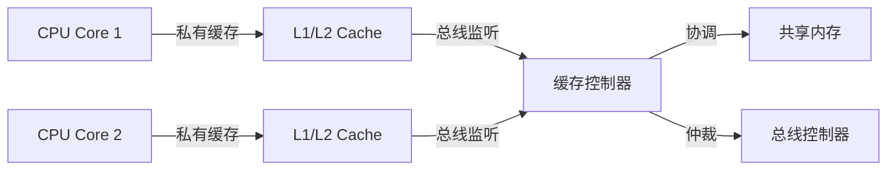
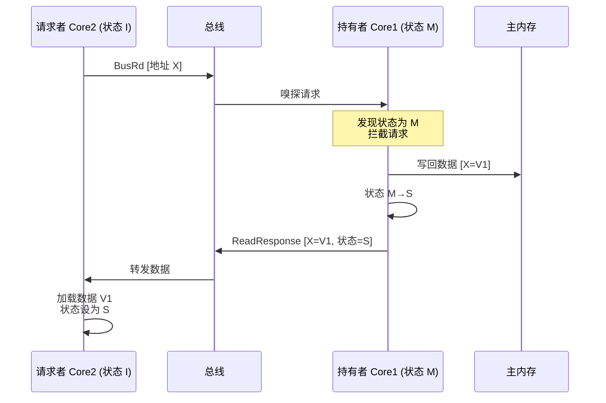
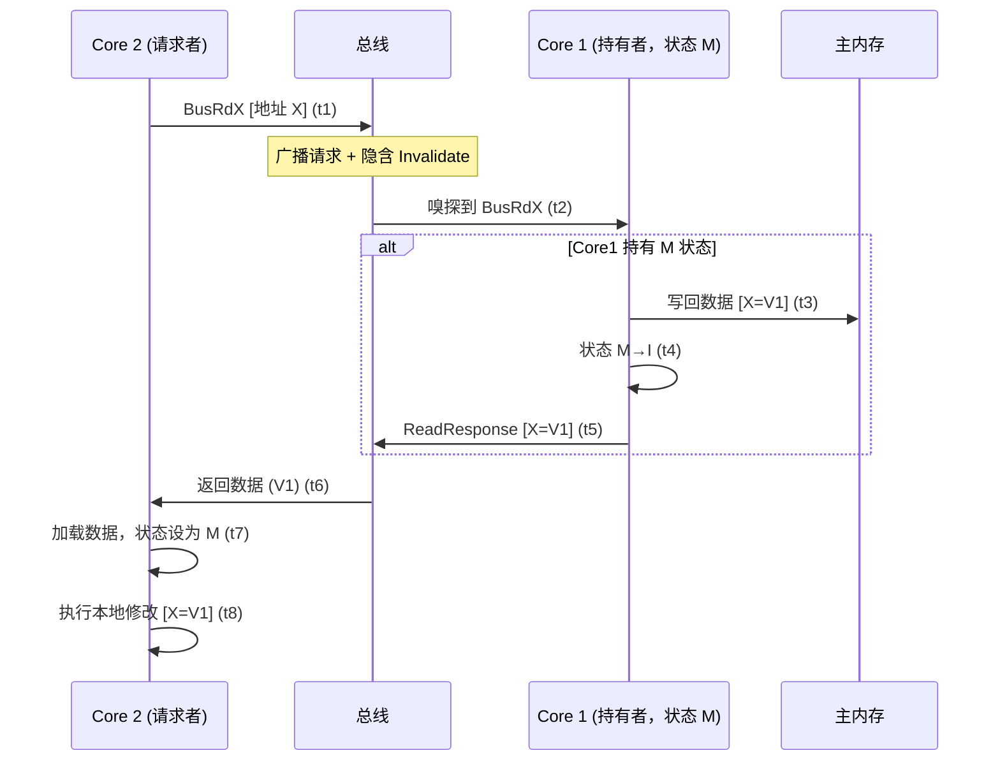
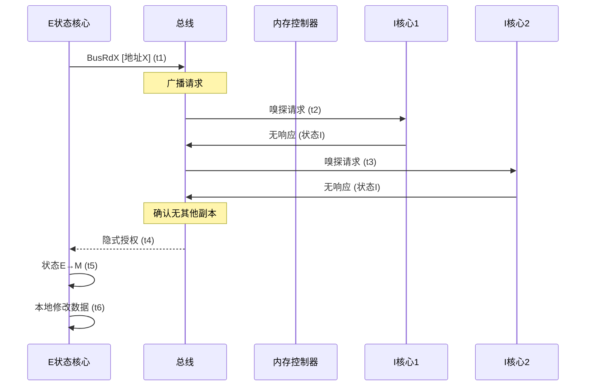
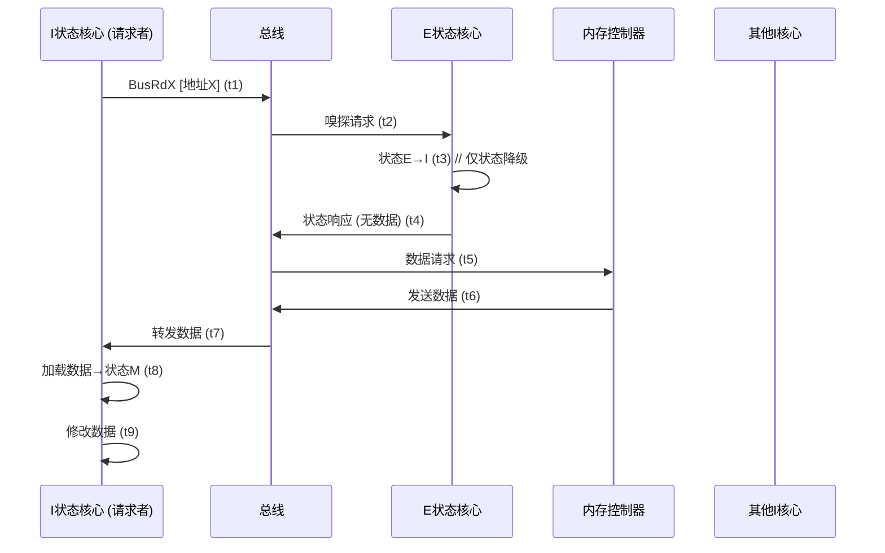
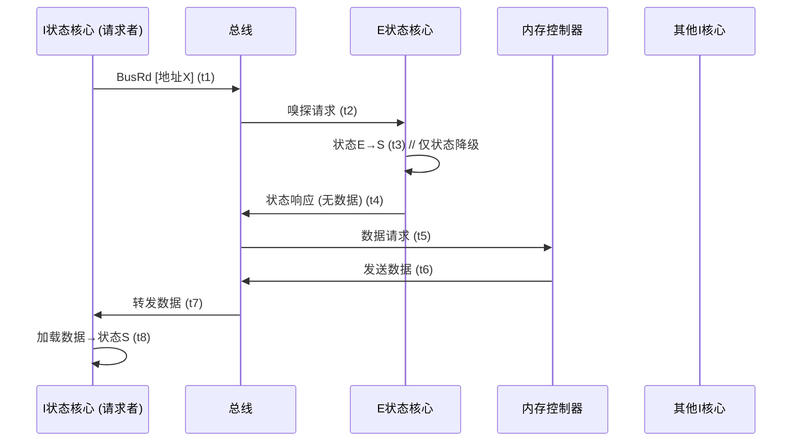
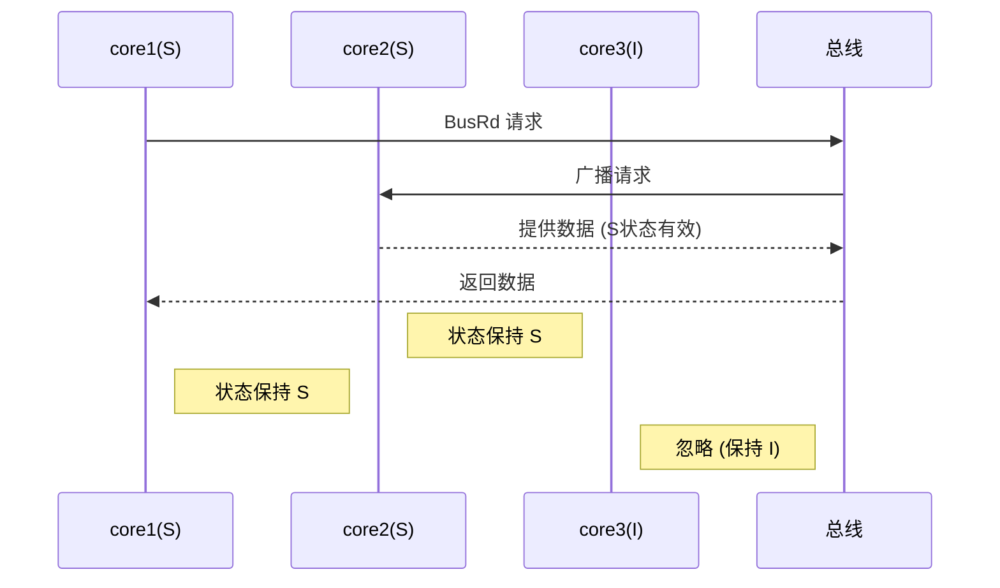
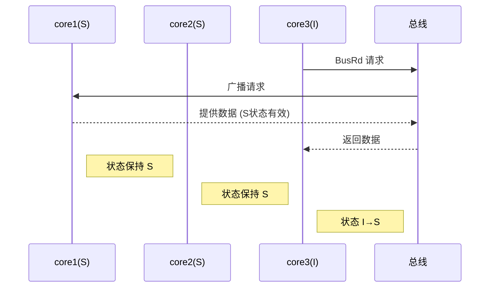
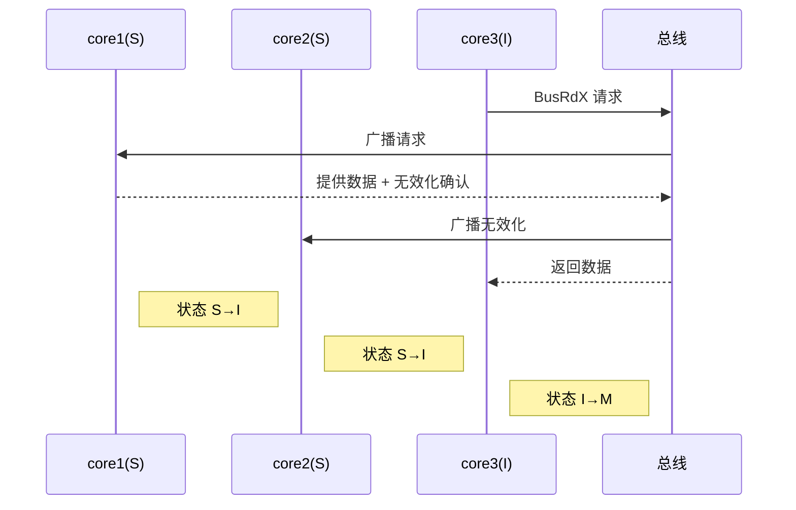

---
#MESI #CPU #缓存 #一致性
---
# 一致性缓存协议MESI

**MESI 缓存一致性协议**是现代多核 CPU 中用于维护各个核心私有缓存（L1, L2）与共享主内存之间数据一致性的核心机制之一。
**核心目标：** 确保所有 CPU 核心看到的内存视图是一致的。当一个核心修改了其缓存中某个内存位置的数据时，其他核心缓存中该数据的副本要么被更新，要么被标记为无效，以保证它们下次读取时能获得最新值。

**缓存一致性协议（如 MESI）是 CPU 硬件的核心功能**，完全由硬件自动实现。

重要概念：
**缓存行 (Cache Line)：** CPU 缓存管理数据的基本单位（通常是 64 字节）。当 CPU 访问内存时，它不是只读取一个字节或一个字，而是读取包含目标地址的整个缓存行。MESI 协议管理的就是缓存行的状态。这个会导致对于上层语言来说，一个缓存行可能包含多个共享变量，会导致有多个线程需要同时修改这个缓存行。无关变量共享缓存行，会触发无效的性能损耗，**伪共享 (False Sharing)**。

## M(Modified)已修改

- **含义：** 该缓存行中的数据已被当前核心**修改过**，并且是**最新、唯一有效**的副本。
- **与主内存的关系：** 主内存中的数据是**过时**的。
- **其他核心：** 其他核心的缓存中**没有**该缓存行的有效副本（如果有，也必须是 `Invalid` 状态）。
- **权限：** 当前核心拥有对该缓存行的**独占写权限**。它可以随时再次写入，无需通知其他核心。
- **回写时机：** 当该缓存行需要被替换（如为新数据腾空间）时，或者有其他核心请求读取该行数据时，当前核心**必须**将修改后的数据写回主内存，并将状态降级（通常为 `Shared` 或 `Invalid`）。

## E(Exclusive) 独占

- **含义：** 该缓存行中的数据是**干净的**（与主内存一致），并且**只有当前核心**拥有该缓存行的副本。
- **与主内存的关系：** 数据与主内存**一致**。
- **其他核心：** 其他核心的缓存中**没有**该缓存行的副本（如果有，也必须是 `Invalid` 状态）。
- **权限：** 当前核心拥有对该缓存行的**独占写权限潜力**。如果它要写入，可以直接修改并将状态升级为 `Modified`，**无需与其他核心通信**（因为它是唯一拥有者）。
- **读取行为：** 如果其他核心请求读取该行，当前核心可以将其状态降级为 `Shared`（因为现在有多个读者了）。

## S(Shared) 共享

- **含义：** 该缓存行中的数据是**干净的**（与主内存一致），并且**有多个核心**同时拥有该缓存行的副本。
- **与主内存的关系：** 数据与主内存**一致**。
- **其他核心：** 其他核心的缓存中**也有**该缓存行的副本，且状态也是 `Shared`（或可能是 `Exclusive` 但即将变为 `Shared`）。
- **权限：** **只读权限**。如果当前核心要写入该缓存行，它**必须**先向总线（或其他互连结构）广播一个 `Invalidate` 消息，要求所有其他持有该缓存行副本的核心将其状态置为 `Invalid`。在收到所有 `Invalidate Acknowledge` 确认消息后，当前核心才能将状态升级为 `Modified` 并进行写入操作。这个过程称为 **Write Invalidate**。

## I(Invalid) 失效

- **含义：** 该缓存行中的数据是**无效的**（过时的或从未加载过），不能使用。
- **与主内存的关系：** 无直接关系。缓存行内容不可信。
- **其他核心：** 其他核心可能持有有效的（`M`, `E`, `S`）或无效的（`I`）副本。
- **权限：** 无权限。如果 CPU 需要读取或写入该缓存行对应的内存地址，它**必须**发起一次新的缓存请求。

## **MESI 协议的核心操作与消息**

协议通过 CPU 核心之间以及核心与缓存控制器/总线之间的**消息传递**来协调状态转换。主要消息类型：

1. **Bus Read (总线读 / Read Request):** 当一个核心要读取一个处于 `Invalid` 状态的缓存行时发出。意思是：“我想读地址 X 的数据，谁有最新的？”

2. **Bus Read Exclusive / Bus Upgrade (总线读独占 / 升级请求):** 当一个核心要**写入**一个处于 `Invalid` 或 `Shared` 状态的缓存行时发出。意思是：“我要写地址 X，请让所有持有该行副本的缓存作废它（并给我数据，如果是 `Invalid` 状态）。”

3. **Bus Write / Flush (总线写 / 刷新):** 当一个核心将 `Modified` 状态缓存行的数据写回主内存时发出（通常发生在该行被替换或响应其他核心的 `Read`/`Read Exclusive` 请求时）。意思是：“这是地址 X 的最新数据，更新主内存吧。”

4. **Invalidate (无效化):** 通常由发出 `Bus Read Exclusive` 请求的核心广播，要求所有其他核心将指定地址的缓存行状态置为 `Invalid`。意思是：“地址 X 的数据我要改了，你们手上的都作废！”

5. **Invalidate Acknowledge (无效化确认):** 其他核心收到 `Invalidate` 消息后，将对应缓存行置为 `Invalid`（如果需要回写 `Modified` 数据则先回写），然后发送此确认消息。意思是：“地址 X 的缓存行我已作废（或已回写并作废）。”

6. **Read Response (读响应):** 可能由主内存或其他缓存发出，响应 `Bus Read` 或 `Bus Read Exclusive` 请求。
    - 如果其他缓存有 `Modified` 状态的行：该缓存会拦截请求，将数据写回主内存（状态降为 `Shared`），并通过总线将数据发送给请求者（请求者状态设为 `Shared`）。
    - 如果其他缓存有 `Shared` 或 `Exclusive` 状态的行：它们可能会直接提供数据（`Shared`）或允许请求者从内存读取（`Exclusive` 核心可能无动作或降级）。
    - 如果其他缓存都没有有效副本：主内存提供数据。

状态限制：

1. **M状态**：只能有一个核心持有，且其他核心必须为I
2. **E状态**：只能有一个核心持有，且其他核心必须为I
3. **S状态**：至少有两个核心同时持有S（也就是说，不能只有一个核心处于S状态，因为单核心的干净副本应该是E状态）
4. **I状态**：任意数量（0个或多个）

也就是说，如果有三个核心core1 core2 core3，那么对于同一个缓存行来说，状态只有可能是MII、EII、SSI、SSS、III这五种情况。

## 状态为MII时

### 场景一：I 核心发出 BusRd

core2核心状态为I，当发出BusRd请求读取数据时，core1会将缓存写入主存，状态转换为S，core2也会转换为S

1. **Core 2** 读地址 X（状态 `I`）→ 发出 `BusRd`
2. **Core 1** 嗅探到请求，发现自己持有 `M` 状态：
 - 将数据 **V1** 写回主存（保证持久化）
 - 状态降为 `Shared (S)`（不再独占）
3. **Core 1** 通过总线发送 **Read Response**（含数据 V1 和状态提示 `S`）
4. **Core 2** 直接接收数据 V1，状态设为 `S`
5. **内存控制器**：仅备份数据（不参与传输）

### 场景二：I 核心发出 BusRdX

core2核心状态为I，当发出BusRd请求读取数据时，core1会将缓存写入主存，状态转换为I，core2也会转换为M

#### 阶段 1：请求发起 (t1)

- **Core 2** 需要修改地址 X
- 发送 **BusRdX** 请求（包含两个隐含命令）：
    1. 请求数据最新值（类似 BusRd）
    2. 要求其他核心**立即使副本失效**（广播 Invalidate）

#### 阶段 2：数据源响应 (t2-t5)

- **Core 1**（状态 `M`）嗅探到请求：
  - 立即将脏数据 **V1 写回内存**（t3）
  - 状态降为 `Invalid`（t4）
  - 发送 **ReadResponse** 包含最新数据 V1（t5）

#### 阶段 3：请求者处理 (t6-t8)

- **Core 2** 收到数据（V1）后：
  - 加载数据到本地缓存（t6）
  - **状态直接设为 `M`**（独占且可修改）（t7）
  - 执行本地修改（如 V1）（t8）
  - **无需额外总线事务**（状态已为 M）

## 状态为EII时

### 场景一：E 核心发出 BusRdX

1. 由于其他核心都是 I 状态，无需发送 Invalidate
2. E → M（直接升级）
3. 修改本地缓存，**不写回内存**
4. MII（原 E 核心变为 M，其他仍为 I）

### 场景二：I 核心发出 BusRdX

1. **E 核心行为**：
    - 状态降级 E→I
    - **不提供数据**（仅发送状态响应）
2. **数据来源**：内存控制器提供数据
3. **状态转换**：
    - 请求者：I → M
    - E 核心：E → I
4. **结果状态**：MII（新 M 状态核心）

### 场景三：I 核心发出 BusRd（读请求）

1. **E 核心行为**：
    - 状态降级 E→S
    - **不提供数据**（仅发送状态响应）
2. **数据来源**：内存控制器提供数据
3. **状态转换**：
    - 请求者：I → S
    - E 核心：E → S
4. **结果状态**：SSI（两个 S 状态核心）

## 状态为SSI时

### 场景一：S 状态核心发出 BusRd 请求

### 场景二：S 状态核心发出 BusRdX 请求

### 场景三：I 状态核心发出 BusRd 请求

### 场景四：I 状态核心发出 BusRdX 请求

